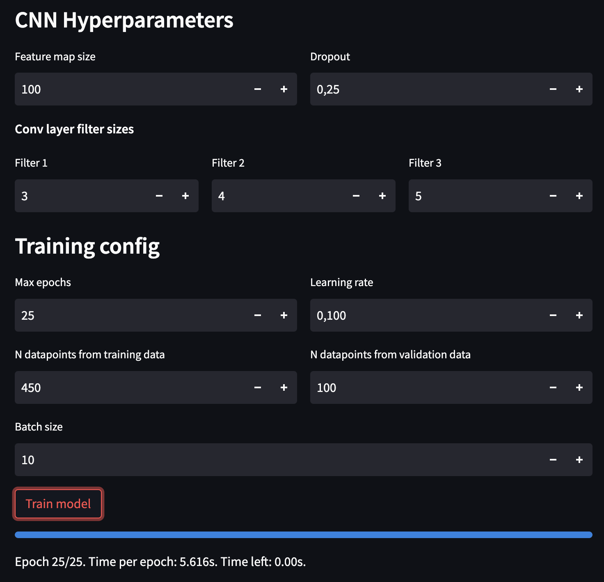
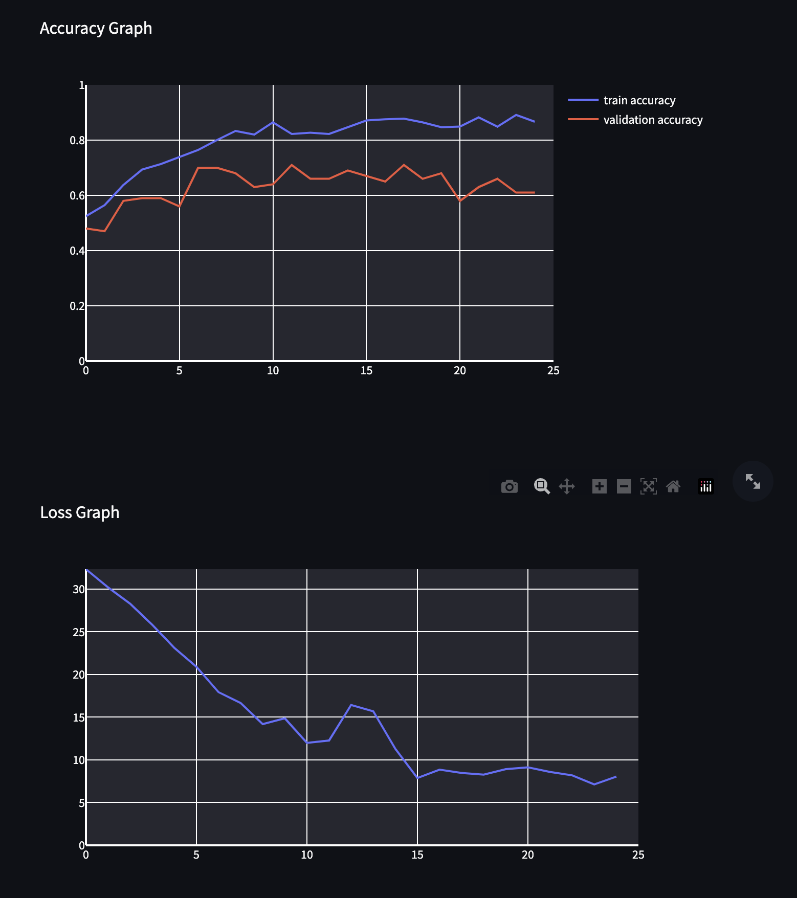

# MiniTorch Module 4


# 4.5 Sentiment





```
Epoch: 1/25, loss: 32.32080803275224, train accuracy: 0.5244444444444445
Epoch: 2/25, loss: 30.188853852648215, train accuracy: 0.5644444444444444
Epoch: 3/25, loss: 28.277807317472575, train accuracy: 0.6377777777777778
Epoch: 4/25, loss: 25.80966769325519, train accuracy: 0.6933333333333334
Epoch: 5/25, loss: 23.103566823584647, train accuracy: 0.7133333333333334
Epoch: 6/25, loss: 20.888525973380904, train accuracy: 0.74
Epoch: 7/25, loss: 17.926669349281546, train accuracy: 0.7644444444444445
Epoch: 8/25, loss: 16.663081308129353, train accuracy: 0.8
Epoch: 9/25, loss: 14.185596682291246, train accuracy: 0.8333333333333334
Epoch: 10/25, loss: 14.867011890132531, train accuracy: 0.82
Epoch: 11/25, loss: 11.989614181801626, train accuracy: 0.8644444444444445
Epoch: 12/25, loss: 12.265498744508024, train accuracy: 0.8222222222222222
Epoch: 13/25, loss: 16.42544683599386, train accuracy: 0.8266666666666667
Epoch: 14/25, loss: 15.686283741064495, train accuracy: 0.8222222222222222
Epoch: 15/25, loss: 11.284489433664438, train accuracy: 0.8466666666666667
Epoch: 16/25, loss: 7.8737201135277735, train accuracy: 0.8711111111111111
Epoch: 17/25, loss: 8.849501059083748, train accuracy: 0.8755555555555555
Epoch: 18/25, loss: 8.46995609648931, train accuracy: 0.8777777777777778
Epoch: 19/25, loss: 8.282765954586521, train accuracy: 0.8644444444444445
Epoch: 20/25, loss: 8.916003819721439, train accuracy: 0.8466666666666667
Epoch: 21/25, loss: 9.133605521472559, train accuracy: 0.8488888888888889
Epoch: 22/25, loss: 8.59349553006427, train accuracy: 0.8822222222222222
Epoch: 23/25, loss: 8.19198319332626, train accuracy: 0.8488888888888889
Epoch: 24/25, loss: 7.1337693457644376, train accuracy: 0.8911111111111111
Epoch: 25/25, loss: 8.042027878334471, train accuracy: 0.8666666666666667
```

# 4.5 mnist

I trained with learning rate of 0.1 . As we see, with more epochs and a smaller training learning rate my loss should be much smaller.

```
Epoch: 1/25, loss: 2.315980635261316, correct: 3
Epoch: 1/25, loss: 11.440430073042272, correct: 2
Epoch: 1/25, loss: 11.52382832686997, correct: 2
Epoch: 1/25, loss: 11.164372085234422, correct: 6
Epoch: 1/25, loss: 11.79384653555086, correct: 3
Epoch: 1/25, loss: 11.86872255784514, correct: 2
Epoch: 1/25, loss: 11.480945191343704, correct: 2
Epoch: 1/25, loss: 11.499855990332778, correct: 2
Epoch: 1/25, loss: 11.487361079491063, correct: 2
Epoch: 1/25, loss: 11.547402317905075, correct: 2
Epoch: 1/25, loss: 11.528697903707775, correct: 3
Epoch: 1/25, loss: 11.531067278374442, correct: 2
Epoch: 1/25, loss: 11.44977664824292, correct: 2
Epoch: 2/25, loss: 2.293383288342513, correct: 2
Epoch: 2/25, loss: 11.448274017952283, correct: 3
Epoch: 2/25, loss: 10.791242966417132, correct: 3
Epoch: 2/25, loss: 12.121101914223196, correct: 2
Epoch: 2/25, loss: 11.542539816343242, correct: 2
Epoch: 2/25, loss: 11.458838436686921, correct: 2
Epoch: 2/25, loss: 11.466383803839914, correct: 2
Epoch: 2/25, loss: 11.488955830874911, correct: 2
Epoch: 2/25, loss: 11.470319920526398, correct: 2
Epoch: 2/25, loss: 11.540244903927332, correct: 2
Epoch: 2/25, loss: 11.5566355423516, correct: 2
Epoch: 2/25, loss: 11.514979053330356, correct: 2
Epoch: 2/25, loss: 11.435956206585946, correct: 2
Epoch: 3/25, loss: 2.2866048019185925, correct: 2
Epoch: 3/25, loss: 11.503325715904477, correct: 2
Epoch: 3/25, loss: 11.464653644218355, correct: 2
Epoch: 3/25, loss: 11.467967105073999, correct: 2
Epoch: 3/25, loss: 11.51426552596337, correct: 3
Epoch: 3/25, loss: 11.373865837200485, correct: 3
Epoch: 3/25, loss: 12.502271024845065, correct: 4
Epoch: 3/25, loss: 11.541701583313865, correct: 4
Epoch: 3/25, loss: 11.45296972181117, correct: 2
Epoch: 3/25, loss: 11.609081026627866, correct: 3
Epoch: 3/25, loss: 11.54528502836908, correct: 2
Epoch: 3/25, loss: 11.518120461406713, correct: 2
Epoch: 3/25, loss: 11.41929807620239, correct: 2
Epoch: 4/25, loss: 2.282483438807485, correct: 2
Epoch: 4/25, loss: 11.504283808609877, correct: 2
Epoch: 4/25, loss: 11.443410702958808, correct: 2
Epoch: 4/25, loss: 11.514546015618544, correct: 4
Epoch: 4/25, loss: 11.49728718604271, correct: 4
Epoch: 4/25, loss: 11.39512766799395, correct: 3
Epoch: 4/25, loss: 11.468536935448935, correct: 2
Epoch: 4/25, loss: 11.491874094394829, correct: 2
Epoch: 4/25, loss: 11.413137894417186, correct: 4
Epoch: 4/25, loss: 11.563251666095452, correct: 4
Epoch: 4/25, loss: 11.520397788781777, correct: 4
Epoch: 4/25, loss: 11.480602782451625, correct: 2
Epoch: 4/25, loss: 11.3972188353832, correct: 2
Epoch: 5/25, loss: 2.2817894476440164, correct: 2
Epoch: 5/25, loss: 11.468330632484072, correct: 2
Epoch: 5/25, loss: 11.399298808359006, correct: 2
Epoch: 5/25, loss: 11.447700943213174, correct: 4
Epoch: 5/25, loss: 11.444480234006521, correct: 3
Epoch: 5/25, loss: 11.332265228379821, correct: 4
Epoch: 5/25, loss: 11.388715351713921, correct: 4
Epoch: 5/25, loss: 11.380145578284596, correct: 4
Epoch: 5/25, loss: 11.341595363917616, correct: 4
Epoch: 5/25, loss: 11.469873338099173, correct: 4
Epoch: 5/25, loss: 11.42673021294689, correct: 4
Epoch: 5/25, loss: 11.427078068728836, correct: 4
Epoch: 5/25, loss: 11.25167125121722, correct: 2
Epoch: 6/25, loss: 2.2561084098406647, correct: 3
Epoch: 6/25, loss: 11.33342798036118, correct: 3
Epoch: 6/25, loss: 11.284387107289739, correct: 4
Epoch: 6/25, loss: 11.33613779437206, correct: 4
Epoch: 6/25, loss: 11.280466415221508, correct: 4
Epoch: 6/25, loss: 11.213518267343968, correct: 4
Epoch: 6/25, loss: 11.1248404160157, correct: 4
Epoch: 6/25, loss: 11.2331391137426, correct: 4
Epoch: 6/25, loss: 11.236511536322773, correct: 4
Epoch: 6/25, loss: 11.243096851561251, correct: 4
Epoch: 6/25, loss: 11.055641704070297, correct: 5
Epoch: 6/25, loss: 11.038351056935385, correct: 5
Epoch: 6/25, loss: 10.9800265212216, correct: 3
Epoch: 7/25, loss: 2.2054513926776482, correct: 4
Epoch: 7/25, loss: 11.026350647474683, correct: 5
Epoch: 7/25, loss: 10.733597223595043, correct: 5
Epoch: 7/25, loss: 10.692476053875346, correct: 6
Epoch: 7/25, loss: 10.675706447574548, correct: 5
Epoch: 7/25, loss: 10.474847294758593, correct: 5
Epoch: 7/25, loss: 10.244841466475096, correct: 7
Epoch: 7/25, loss: 10.436193297422506, correct: 7
Epoch: 7/25, loss: 10.311935235470752, correct: 6
Epoch: 7/25, loss: 10.02635384902501, correct: 6
Epoch: 7/25, loss: 9.870011073550133, correct: 7
Epoch: 7/25, loss: 9.667100059502198, correct: 6
Epoch: 7/25, loss: 9.415237600557342, correct: 8
Epoch: 8/25, loss: 1.72541816593153, correct: 4
Epoch: 8/25, loss: 9.290583374084, correct: 5
Epoch: 8/25, loss: 8.834879590900275, correct: 7
Epoch: 8/25, loss: 9.040561613145577, correct: 8
Epoch: 8/25, loss: 8.653608830844403, correct: 9
Epoch: 8/25, loss: 7.9691404793557306, correct: 6
Epoch: 8/25, loss: 7.742461619414107, correct: 10
Epoch: 8/25, loss: 8.900058489133704, correct: 9
Epoch: 8/25, loss: 8.429123757771631, correct: 9
Epoch: 8/25, loss: 7.697277177446702, correct: 8
Epoch: 8/25, loss: 7.7413795830758545, correct: 10
Epoch: 8/25, loss: 8.103148623159129, correct: 9
Epoch: 8/25, loss: 7.702379450589278, correct: 9
Epoch: 9/25, loss: 1.171438967759739, correct: 9
Epoch: 9/25, loss: 7.200827198454013, correct: 10
Epoch: 9/25, loss: 7.060361978553891, correct: 12
Epoch: 9/25, loss: 7.198608183745288, correct: 11
Epoch: 9/25, loss: 6.706060370427267, correct: 12
Epoch: 9/25, loss: 6.1642309634682455, correct: 12
Epoch: 9/25, loss: 5.818209037112252, correct: 11
Epoch: 9/25, loss: 7.578783709078081, correct: 12
Epoch: 9/25, loss: 6.937168260789663, correct: 12
Epoch: 9/25, loss: 6.313960892680895, correct: 11
Epoch: 9/25, loss: 6.226513889105503, correct: 12
Epoch: 9/25, loss: 6.818015930385208, correct: 11
Epoch: 9/25, loss: 6.648304838683808, correct: 12
Epoch: 10/25, loss: 1.0779346931364835, correct: 12
Epoch: 10/25, loss: 5.651110153818191, correct: 12
Epoch: 10/25, loss: 5.433008505219185, correct: 12
Epoch: 10/25, loss: 5.852678475411731, correct: 12
Epoch: 10/25, loss: 5.59497551599333, correct: 14
Epoch: 10/25, loss: 5.090146396469151, correct: 11
Epoch: 10/25, loss: 5.350938860706247, correct: 13
Epoch: 10/25, loss: 6.681926463326907, correct: 13
Epoch: 10/25, loss: 6.473575823199393, correct: 11
Epoch: 10/25, loss: 5.629219040326827, correct: 14
Epoch: 10/25, loss: 6.092870620881923, correct: 14
Epoch: 10/25, loss: 6.4158911923298, correct: 13
Epoch: 10/25, loss: 6.1695766260519775, correct: 12
Epoch: 11/25, loss: 0.9245534529439569, correct: 13
Epoch: 11/25, loss: 5.508080776738622, correct: 13
Epoch: 11/25, loss: 5.5883608218220076, correct: 12
Epoch: 11/25, loss: 5.307192340296892, correct: 13
Epoch: 11/25, loss: 4.691543964547586, correct: 14
Epoch: 11/25, loss: 4.314030929002257, correct: 14
Epoch: 11/25, loss: 5.118425425651804, correct: 13
Epoch: 11/25, loss: 6.094837843580373, correct: 14
Epoch: 11/25, loss: 5.769950677453135, correct: 13
Epoch: 11/25, loss: 4.704839477424576, correct: 13
Epoch: 11/25, loss: 5.155177957572944, correct: 13
Epoch: 11/25, loss: 6.154644154401523, correct: 13
Epoch: 11/25, loss: 6.070654361276409, correct: 13
Epoch: 12/25, loss: 0.6596630918857397, correct: 13
Epoch: 12/25, loss: 4.739768915500886, correct: 13
Epoch: 12/25, loss: 4.383198108035096, correct: 14
Epoch: 12/25, loss: 4.78766789565231, correct: 13
Epoch: 12/25, loss: 3.7585385720260343, correct: 15
Epoch: 12/25, loss: 3.72493587890568, correct: 13
Epoch: 12/25, loss: 4.811269612957376, correct: 11
Epoch: 12/25, loss: 5.076479952961759, correct: 12
Epoch: 12/25, loss: 5.099680181938004, correct: 13
Epoch: 12/25, loss: 3.8291031996454907, correct: 13
Epoch: 12/25, loss: 4.314327258282297, correct: 13
Epoch: 12/25, loss: 5.152661026703774, correct: 13
Epoch: 12/25, loss: 6.252627303108963, correct: 13
Epoch: 13/25, loss: 0.7544417397020334, correct: 13
Epoch: 13/25, loss: 4.572480668067299, correct: 14
Epoch: 13/25, loss: 3.7368316397655605, correct: 14
Epoch: 13/25, loss: 5.085841825744044, correct: 13
Epoch: 13/25, loss: 3.902178913158599, correct: 14
Epoch: 13/25, loss: 3.8774057503941086, correct: 12
Epoch: 13/25, loss: 3.9669039848258825, correct: 13
Epoch: 13/25, loss: 4.750531563309188, correct: 14
Epoch: 13/25, loss: 4.998736295183113, correct: 14
Epoch: 13/25, loss: 4.219442377145662, correct: 13
Epoch: 13/25, loss: 3.9037035837553207, correct: 14
Epoch: 13/25, loss: 5.297714384142727, correct: 13
Epoch: 13/25, loss: 5.690186544920871, correct: 13
Epoch: 14/25, loss: 0.912770641155266, correct: 13
Epoch: 14/25, loss: 4.7563720764203445, correct: 13
Epoch: 14/25, loss: 3.4066912684783714, correct: 14
Epoch: 14/25, loss: 4.71393230674686, correct: 14
Epoch: 14/25, loss: 3.444245633944257, correct: 15
Epoch: 14/25, loss: 3.8907388596097316, correct: 12
Epoch: 14/25, loss: 4.07310188616912, correct: 14
Epoch: 14/25, loss: 4.315793772391363, correct: 15
Epoch: 14/25, loss: 5.065565321298259, correct: 14
Epoch: 14/25, loss: 4.038841071894581, correct: 13
Epoch: 14/25, loss: 4.159518053007455, correct: 14
Epoch: 14/25, loss: 4.838141312162155, correct: 13
Epoch: 14/25, loss: 4.80204701650229, correct: 14
Epoch: 15/25, loss: 0.5409970158076803, correct: 14
Epoch: 15/25, loss: 3.56874331382438, correct: 15
Epoch: 15/25, loss: 4.369363727152582, correct: 15
Epoch: 15/25, loss: 4.060063942912462, correct: 15
Epoch: 15/25, loss: 3.3665098438145424, correct: 14
Epoch: 15/25, loss: 3.687334190722211, correct: 13
Epoch: 15/25, loss: 3.603751235795181, correct: 13
Epoch: 15/25, loss: 4.160577989281221, correct: 13
Epoch: 15/25, loss: 4.069659505628184, correct: 14
Epoch: 15/25, loss: 3.1113492733168977, correct: 12
Epoch: 15/25, loss: 4.375723258780899, correct: 14
Epoch: 15/25, loss: 4.3457512132369756, correct: 13
Epoch: 15/25, loss: 4.780470475911395, correct: 14
Epoch: 16/25, loss: 0.5268373249137668, correct: 13
Epoch: 16/25, loss: 3.5737770604353543, correct: 13
Epoch: 16/25, loss: 3.7017031568735472, correct: 15
Epoch: 16/25, loss: 3.8850323704549927, correct: 15
Epoch: 16/25, loss: 3.1578168534010356, correct: 14
Epoch: 16/25, loss: 3.5546272971497825, correct: 13
Epoch: 16/25, loss: 3.86083139675845, correct: 14
Epoch: 16/25, loss: 3.8309383423078707, correct: 14
Epoch: 16/25, loss: 3.7631873727892273, correct: 13
Epoch: 16/25, loss: 2.963629227056649, correct: 12
Epoch: 16/25, loss: 3.583952880779687, correct: 14
Epoch: 16/25, loss: 5.079495182194866, correct: 14
Epoch: 16/25, loss: 3.6406866173964287, correct: 14
Epoch: 17/25, loss: 0.6255277508279536, correct: 13
Epoch: 17/25, loss: 4.290631526236373, correct: 15
Epoch: 17/25, loss: 3.284985576466074, correct: 15
Epoch: 17/25, loss: 4.185321979935185, correct: 15
Epoch: 17/25, loss: 3.342392014089207, correct: 13
Epoch: 17/25, loss: 3.012632739488719, correct: 13
Epoch: 17/25, loss: 3.0411733599519644, 0.03 0.01 -0.00 0.05 0.04 0.05 0.02 0.02 0.04 -0.03 0.01 0.00 -0.02 0.01 -0.03 0.01 0.01 0.03 -0.01 -0.03 0.01 -0.01Epoch: 17/25, loss: 4.747991253246676, correct: 14
Epoch: 17/25, loss: 2.86213836168252, correct: 14
Epoch: 17/25, loss: 3.4039562032962833, correct: 15
Epoch: 17/25, loss: 4.859600997177111, correct: 15
Epoch: 17/25, loss: 3.6651269921621292, correct: 14
Epoch: 18/25, loss: 0.637351704615172, correct: 14
Epoch: 18/25, loss: 3.7880608825264903, correct: 14
Epoch: 18/25, loss: 3.6801135596041368, correct: 14
Epoch: 18/25, loss: 3.6569456923638435, correct: 15
Epoch: 18/25, loss: 2.2605165930311766, correct: 15
Epoch: 18/25, loss: 2.925976850069264, correct: 13
Epoch: 18/25, loss: 3.66165465514439, correct: 14
Epoch: 18/25, loss: 3.677633596825164, correct: 13
Epoch: 18/25, loss: 3.322202466205033, correct: 14
Epoch: 18/25, loss: 2.970848153506701, correct: 13
Epoch: 18/25, loss: 3.064978074448926, correct: 15
Epoch: 18/25, loss: 4.683574049534864, correct: 14
Epoch: 18/25, loss: 3.7721527708176352, correct: 15
Epoch: 19/25, loss: 0.26274122211226725, correct: 14
Epoch: 19/25, loss: 3.1614639737888846, correct: 15
Epoch: 19/25, loss: 3.0853985422011965, correct: 15
Epoch: 19/25, loss: 3.0289654365626255, correct: 15
Epoch: 19/25, loss: 2.2427801161427054, correct: 14
Epoch: 19/25, loss: 3.3929883001205132, correct: 13
Epoch: 19/25, loss: 2.7902561568072626, correct: 15
Epoch: 19/25, loss: 3.675212181986974, correct: 13
Epoch: 19/25, loss: 3.652702628928007, correct: 13
Epoch: 19/25, loss: 2.151306077384929, correct: 13
Epoch: 19/25, loss: 2.6164053779791088, correct: 15
Epoch: 19/25, loss: 4.3309717135275925, correct: 14
Epoch: 19/25, loss: 3.1699004171543317, correct: 14
Epoch: 20/25, loss: 0.45527955636945955, correct: 15
Epoch: 20/25, loss: 2.7554278498801072, correct: 15
Epoch: 20/25, loss: 2.914235064099861, correct: 15
Epoch: 20/25, loss: 2.6043918113626283, correct: 14
Epoch: 20/25, loss: 1.7752660923217396, correct: 14
Epoch: 20/25, loss: 2.485228133211381, correct: 15
Epoch: 20/25, loss: 2.5118595674733917, correct: 13
Epoch: 20/25, loss: 3.006999316435682, correct: 15
Epoch: 20/25, loss: 3.5275745770159017, correct: 14
Epoch: 20/25, loss: 2.048424634024877, correct: 14
Epoch: 20/25, loss: 2.7910608218149444, correct: 15
Epoch: 20/25, loss: 3.6264169725434874, correct: 15
Epoch: 20/25, loss: 2.777498192724141, correct: 15
Epoch: 21/25, loss: 0.2081470258104908, correct: 15
Epoch: 21/25, loss: 2.3510228099951256, correct: 15
Epoch: 21/25, loss: 2.978301464233312, correct: 15
Epoch: 21/25, loss: 2.8453121514738684, correct: 15
Epoch: 21/25, loss: 1.4594376142124759, correct: 15
Epoch: 21/25, loss: 2.8582541262088723, correct: 14
Epoch: 21/25, loss: 2.1077246010749473, correct: 12
Epoch: 21/25, loss: 2.628167655868734, correct: 15
Epoch: 21/25, loss: 2.1979079265586794, correct: 11
Epoch: 21/25, loss: 3.257738230681098, correct: 16
Epoch: 21/25, loss: 2.1854264268280446, correct: 15
Epoch: 21/25, loss: 3.2268631174792164, correct: 16
Epoch: 21/25, loss: 2.0654583962272226, correct: 15
Epoch: 22/25, loss: 0.19593459631742996, correct: 15
Epoch: 22/25, loss: 2.393752650600802, correct: 15
Epoch: 22/25, loss: 2.4595222795934255, correct: 14
Epoch: 22/25, loss: 2.615876492133945, correct: 12
Epoch: 22/25, loss: 2.1051451502015, correct: 13
Epoch: 22/25, loss: 1.655628265764243, correct: 14
Epoch: 22/25, loss: 2.6762385073789163, correct: 14
Epoch: 22/25, loss: 2.3308585600336973, correct: 16
Epoch: 22/25, loss: 2.626841052555829, correct: 14
Epoch: 22/25, loss: 2.1090904779082904, correct: 16
Epoch: 22/25, loss: 1.4714820748464377, correct: 16
Epoch: 22/25, loss: 3.5793722150257508, correct: 15
Epoch: 22/25, loss: 1.9244201386737747, correct: 14
Epoch: 23/25, loss: 0.30686784300019054, correct: 15
Epoch: 23/25, loss: 2.226118958536293, correct: 15
Epoch: 23/25, loss: 2.8254068208285985, correct: 15
Epoch: 23/25, loss: 2.0715388123611067, correct: 14
Epoch: 23/25, loss: 0.8439576328070736, correct: 15
Epoch: 23/25, loss: 1.5888159388873015, correct: 15
Epoch: 23/25, loss: 1.842036831980324, correct: 15
Epoch: 23/25, loss: 1.8501270043038256, correct: 16
Epoch: 23/25, loss: 2.618848051851758, correct: 14
Epoch: 23/25, loss: 1.7380481017259928, correct: 14
Epoch: 23/25, loss: 1.832804268811739, correct: 15
Epoch: 23/25, loss: 3.495735030974175, correct: 15
Epoch: 23/25, loss: 2.6953640081692845, correct: 16
Epoch: 24/25, loss: 0.21623347781186902, correct: 15
Epoch: 24/25, loss: 1.8823359751642266, correct: 15
Epoch: 24/25, loss: 1.9660532497685324, correct: 16
Epoch: 24/25, loss: 1.8838149688656227, correct: 15
Epoch: 24/25, loss: 1.2022679100275504, correct: 15
Epoch: 24/25, loss: 1.6804290294504431, correct: 15
Epoch: 24/25, loss: 1.1827102845803994, correct: 14
Epoch: 24/25, loss: 1.5947568875195584, correct: 16
Epoch: 24/25, loss: 1.7669536452829324, correct: 15
Epoch: 24/25, loss: 1.5871926097863265, correct: 15
Epoch: 24/25, loss: 1.2656623379313883, correct: 16
Epoch: 24/25, loss: 3.247697170327197, correct: 14
Epoch: 24/25, loss: 2.0300447595068722, correct: 15
Epoch: 25/25, loss: 0.17876316361865843, correct: 15
Epoch: 25/25, loss: 2.1484747133035333, correct: 16
Epoch: 25/25, loss: 2.280764368799055, correct: 15
Epoch: 25/25, loss: 1.3983988768894793, correct: 14
Epoch: 25/25, loss: 0.8617489135508687, correct: 15
Epoch: 25/25, loss: 1.9269293077055432, correct: 15
Epoch: 25/25, loss: 1.610789338422934, correct: 15
Epoch: 25/25, loss: 2.0047143705439945, correct: 16
```


* Docs: https://minitorch.github.io/

* Overview: https://minitorch.github.io/module4.html

This module requires `fast_ops.py`, `cuda_ops.py`, `scalar.py`, `tensor_functions.py`, `tensor_data.py`, `tensor_ops.py`, `operators.py`, `module.py`, and `autodiff.py` from Module 3.


Additionally you will need to install and download the MNist library.

(On Mac, this may require installing the `wget` command)

```
pip install python-mnist
mnist_get_data.sh
```


* Tests:

```
python run_tests.py
```

This assignment requires the following files from the previous assignments. You can get these by running

```bash
python sync_previous_module.py previous-module-dir current-module-dir
```

The files that will be synced are:

        minitorch/tensor_data.py minitorch/tensor_functions.py minitorch/tensor_ops.py minitorch/operators.py minitorch/scalar.py minitorch/scalar_functions.py minitorch/module.py minitorch/autodiff.py minitorch/module.py project/run_manual.py project/run_scalar.py project/run_tensor.py minitorch/operators.py minitorch/module.py minitorch/autodiff.py minitorch/tensor.py minitorch/datasets.py minitorch/testing.py minitorch/optim.py minitorch/tensor_ops.py minitorch/fast_ops.py minitorch/cuda_ops.py project/parallel_check.py tests/test_tensor_general.py